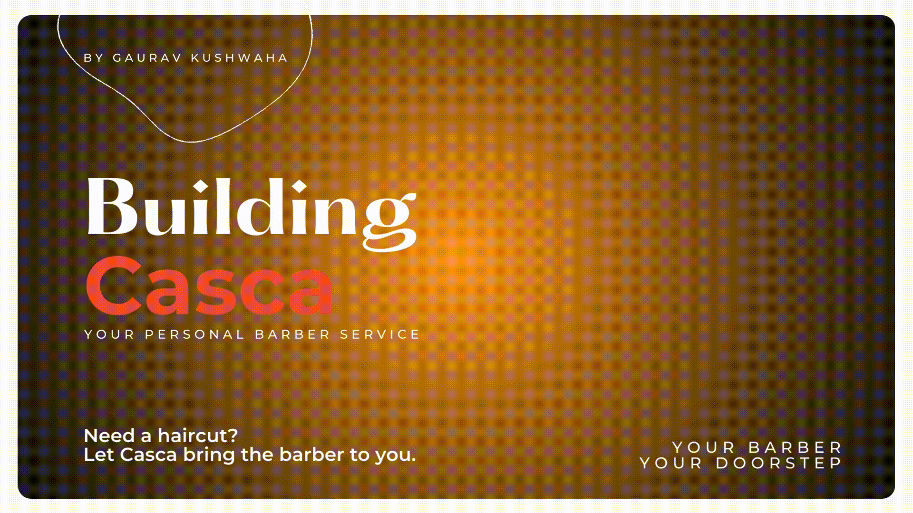
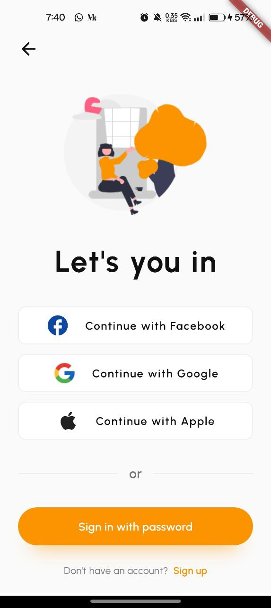
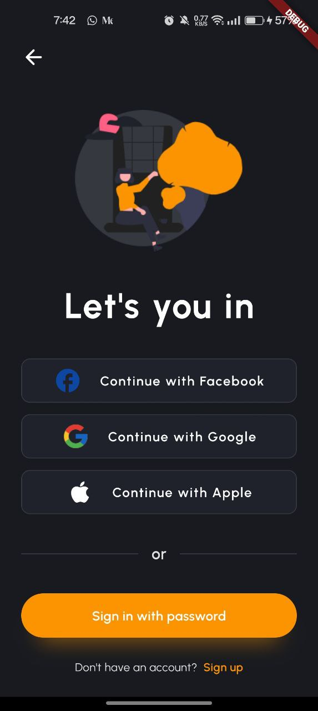
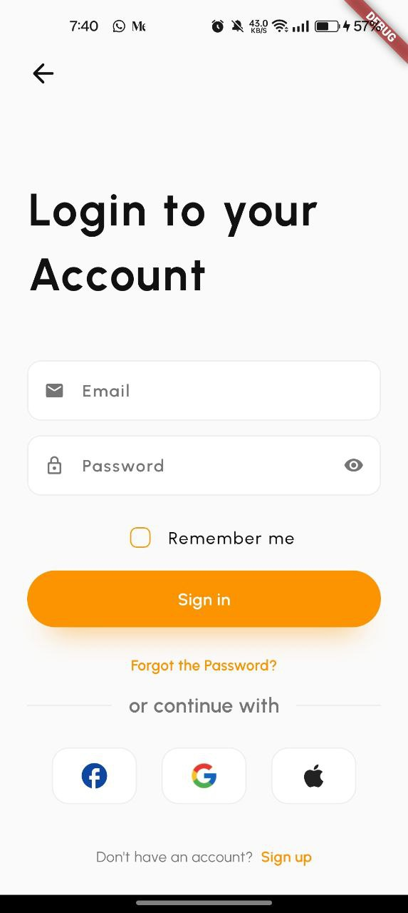
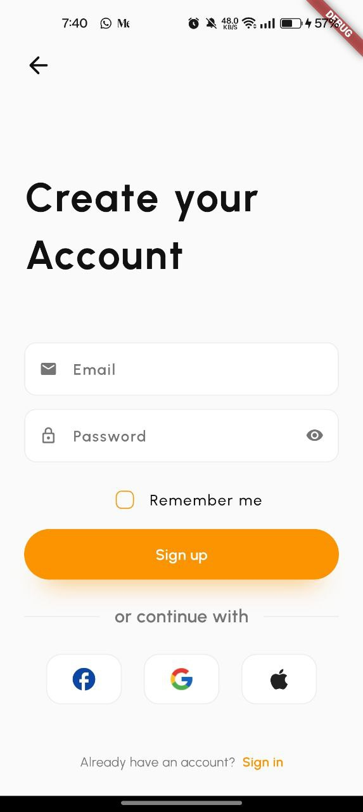
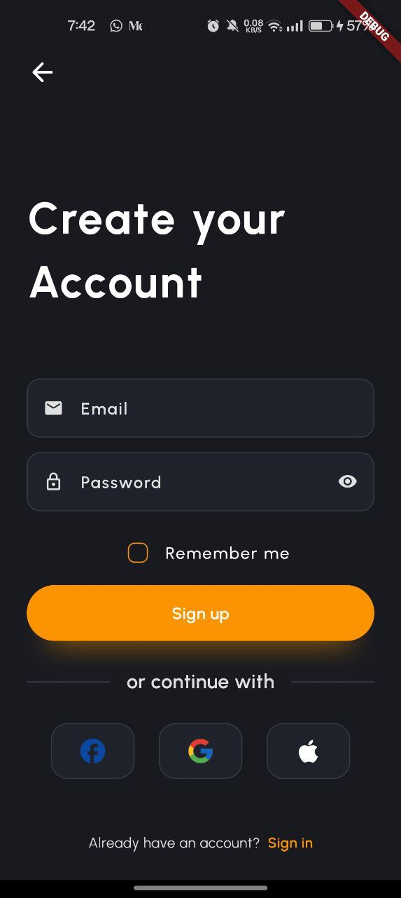
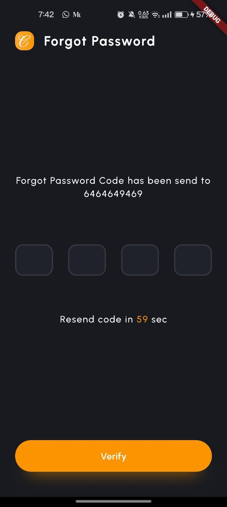
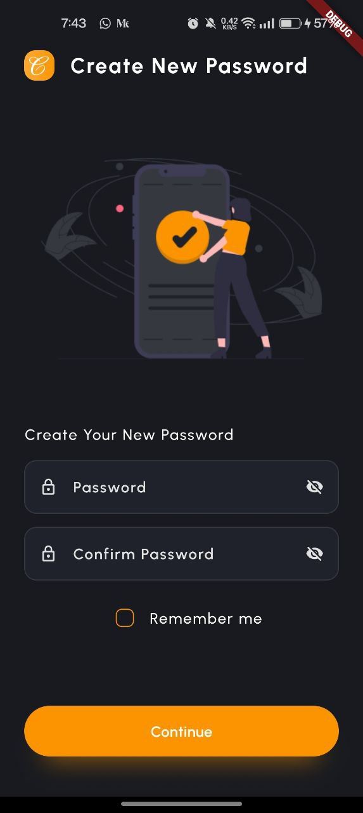

   
   <h1>Casca - Your Eye, Your Doorstep</h1>

 

    
    
    

   <h3>Using BLoC State Management and Clean Architecture</h3>
    
 

### 💇 Overview
Eye AI

### 🌐 Acknowledgements

- All the users who believe in and support Casca.
- Special thanks to the design inspiration from our [Figma Design](https://www.figma.com/design/mc9H8nnbUFP8wG1LBjHVSf/Casca---Barber-%26-Salon-App-UI-Kit-(Preview)-(Copy)?m=auto&fuid=1211050345159188393).

---

### 📷 Screenshots

|       |       |       |       |
|-----------------------------------------------|----------------------------------------------| ------------------------------------------- | ---------------------------------------------- |
|  |  |  |  |
|         |   |        |         |

---

### 📃 License

This project is licensed under the [MIT License](./LICENSE).

---

### 👨🏻‍💻 Connect with me

